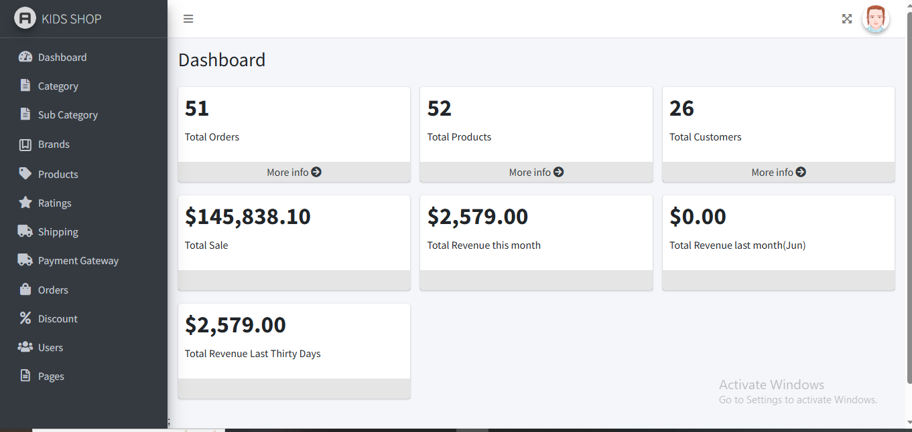
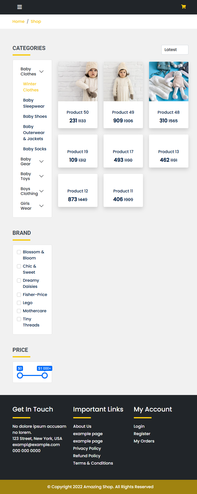
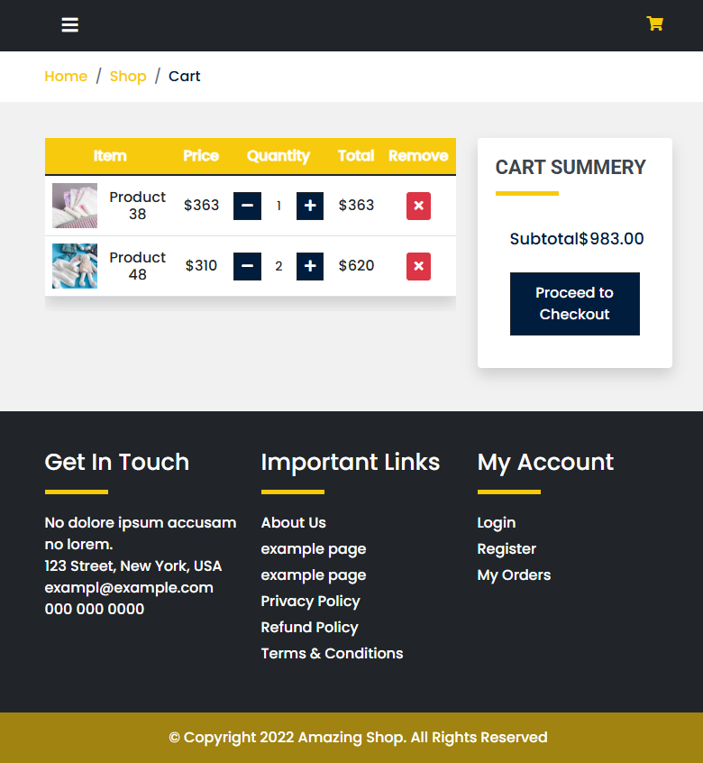

# 🛒 Laravel eCommerce Website

A feature-rich eCommerce platform built with **Laravel 11**, supporting admin management, dynamic product listings, cart and checkout functionality, payment integration, and more.

---

## 🚀 Features

- Admin authentication & dashboard
- Product, category, brand management
- Product details with image gallery
- Add to cart, wishlist, and compare
- Rating & review system
- Coupon & discount support
- Dynamic checkout system
- bKash & Aamarpay integration
- Order tracking and management
- AJAX-powered UI for cart/wishlist
- Responsive design using Bootstrap

---

## 🛠️ Tech Stack

- **Backend:** Laravel 11 (PHP 8+)
- **Frontend:** Blade, Bootstrap 5, AJAX
- **Database:** MySQL
- **Payment Gateway:** bKash,stripe
- **Other Tools:** Git, Postman, Composer, NPM

---

## ⚙️ Installation Guide

### 1. Clone the Repository

```bash
git clone https://github.com/shimacse22/laravel-ecommerce.git
cd laravel-ecommerce

### 2. Install Dependencies
composer install
npm install && npm run dev

### 3. Configure Environment
cp .env.example .env
php artisan key:generate

### 4. Run Migrations & Seeders
php artisan migrate
php artisan db:seed

### 5. Link Storage
php artisan storage:link

### 6. Serve the App
php artisan serve

📸 Screenshots
### 🛠 Admin Panel


### 🛍 Product Page


### 🛒 Cart Page


### 🛒 Checkout Page


🔐 Default Admin Credentials
Email: admin@demo.com  
Password: password

📄 License
This project is open-source and available under the MIT license.

👩‍💻 Developer
Shima Akter
📧 Email: shimacse22@gmail.com
🌐 GitHub: github.com/shimacse22
🔗 LinkedIn: linkedin.com/in/devshima